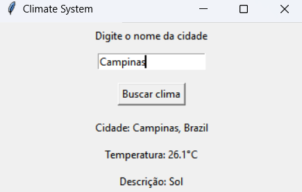

# Climate System


**Climate System** é um aplicativo simples de clima desenvolvido em Python. Ele utiliza a API WeatherAPI para fornecer informações sobre as condições meteorológicas atuais e previsões para qualquer cidade ao redor do mundo. O sistema possui uma interface gráfica construida com Tkinter.

 

# Funcionalidades

- **Consulta do clima atual**: Obtém e exibe a temperatura, descrição do clima e a localização (cidade e País) baseada na entrada do usuário;
- **Interface Gráfica**: Interface para facilitar a interação com o aplicativo.

## Tecnologia Utilizadas

- **Python**: Linguagem de programação principal;
- **Tkinter**: Biblioteca para criar a interface gráfica do usuário;
- **Requests**: Biblioteca para fazer solicitações HTTP à API de clima;
- **WeatherAPI**: Serviço para obter dados meteorológicos.

## Instalação

### Requisitos

- Python 3.6 ou superior
- Pip (gerenciados de pacotes Python)

### Passos para a instalação

1. **Clone o repositório**
   ```bash
   git clone {link do repositorio}
   cd Climate_system
2. **Instale as dependências**
   Certifique-se se você tem o **requests** instalado, se não, instale-o usando pip
   ```bash
   pip install requests
3. Obtenha a chave da API
    - Vá para **WeatherAPI** e inscreva-se para obter uma chave de API gratuita
    - Substitua ´API_KEY´ pelo valor da sua chave da API

## Uso

1. Execute o aplicativo
   ```bash
   python app.py
2. Interaja com a interface
   - Digite o nome de uma cidade no campo de entrada
   - Clique no botão "Buscar Clima" para ver as informações climaticas atuais.

## Exemplo de Uso

```yaml
  Digite o nome da cidade: São Paulo
  [Clique no botão Buscar Clima]

  Cidade: São Paulo, BR
  Temperatura: 25°C
  Descrição: Céu limpo
```

## Licença

- Esse projeto está licenciado sob a licença MIT - veja o arquivo **LICENSE** para mais detalhes.


